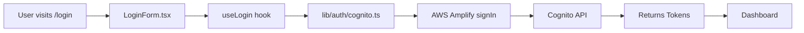
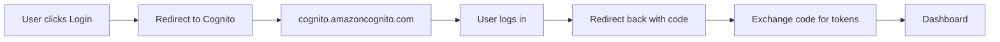

# Cognito UI: Custom vs. Hosted

## What We Built (Custom UI) ✅

Our app uses **custom login pages** that we control completely:

```
┌─────────────────────────────────────────┐
│     http://localhost:3000/login          │
├─────────────────────────────────────────┤
│                                         │
│    [Our Beautiful Login Form]          │
│                                         │
│    Email:    [____________]            │
│    Password: [____________]            │
│                                         │
│    [Login Button]                      │
│                                         │
└─────────────────────────────────────────┘

Managed in our code:
- app/login/page.tsx
- features/auth/components/LoginForm.tsx
- Direct API calls via lib/auth/cognito.ts
```

## What AWS Provides (Hosted UI) ❌ NOT USED

Cognito can host login pages for you:

```
┌─────────────────────────────────────────┐
│  https://your-domain.auth.region.       │
│  amazoncognito.com/login                │
├─────────────────────────────────────────┤
│                                         │
│  [AWS Cognito Default Login Page]      │
│                                         │
│  Username: [____________]              │
│  Password: [____________]              │
│                                         │
│  [Sign In]                             │
│                                         │
└─────────────────────────────────────────┘

We're NOT using this!
```

## Why We Built Custom Pages

✅ **Full control** - Design matches your brand  
✅ **Better UX** - Custom flows and validation  
✅ **More features** - Can add whatever you need  
✅ **No redirects** - Stay on your domain  
✅ **Type-safe** - Full TypeScript integration  

## Authentication Flow

### Our Custom Implementation



**All happens in your app - no external redirects!**

### Hosted UI Flow (NOT USED)



**We skip this complexity!**

## Where Things Are in Our Code

### Login Pages (Custom)
```
app/
├── login/
│   └── page.tsx              # http://localhost:3000/login
├── register/
│   └── page.tsx              # http://localhost:3000/register
└── confirm-signup/
    └── page.tsx              # http://localhost:3000/confirm-signup
```

### Login Components
```
features/auth/components/
├── LoginForm.tsx             # Login form UI
├── RegisterForm.tsx          # Registration form UI
└── ConfirmSignUpForm.tsx     # Email confirmation UI
```

### Authentication Logic
```
lib/auth/
├── cognito.ts                # Direct Cognito API calls
├── amplify-config.ts         # AWS Amplify configuration
└── tokens.ts                 # Token management
```

### Hooks (React Query)
```
features/auth/hooks/
├── useLogin.ts               # Login mutation
├── useRegister.ts            # Register mutation
├── useLogout.ts              # Logout mutation
└── useAuth.ts                # Get current user
```

## Cognito Console Settings

### What Matters for Our App ✅
- User Pool ID
- App Client ID
- Region
- Authentication flows (SRP + Refresh Token)
- Password policy
- Email verification

### What Doesn't Matter ❌
- Cognito domain name (we don't use it)
- Callback URLs (we don't use hosted UI)
- Client secret (we don't send it to browser)
- Hosted UI customization

## FAQ

### Q: Do I need to configure the Cognito domain?
**A:** No! You can skip it or leave it at default. We're not using the hosted UI.

### Q: What about the callback URL?
**A:** For our custom implementation, it doesn't matter. If you need to fill something in, use `http://localhost:3000/`.

### Q: Should I use the client secret?
**A:** No! We use SRP authentication which doesn't require the secret. Don't add it to `.env.local`.

### Q: Can I customize the hosted UI?
**A:** You could, but we're not using it! Our custom pages are better.

### Q: Where do users log in?
**A:** At `http://localhost:3000/login` - your custom page!

### Q: How do I change the login form design?
**A:** Edit `features/auth/components/LoginForm.tsx` - it's just React!

## Testing Your Custom Login

1. Start your app: `pnpm dev`
2. Go to: `http://localhost:3000/login`
3. You see YOUR custom login form (not AWS's)
4. User enters credentials
5. Direct API call to Cognito
6. Tokens returned
7. User redirected to dashboard

**No external redirects, no hosted UI, all your code!** ✅

## Summary

| Feature | Hosted UI | Our Custom UI |
|---------|-----------|---------------|
| **Location** | cognito.amazoncognito.com | localhost:3000 |
| **Design** | AWS default | Your design ✅ |
| **Control** | Limited | Full control ✅ |
| **Redirects** | Yes (annoying) | No (seamless) ✅ |
| **TypeScript** | No | Full types ✅ |
| **Customization** | Limited | Unlimited ✅ |
| **We use it** | ❌ NO | ✅ YES |

**Bottom line**: We built custom login pages. The Cognito hosted UI settings don't affect us!
